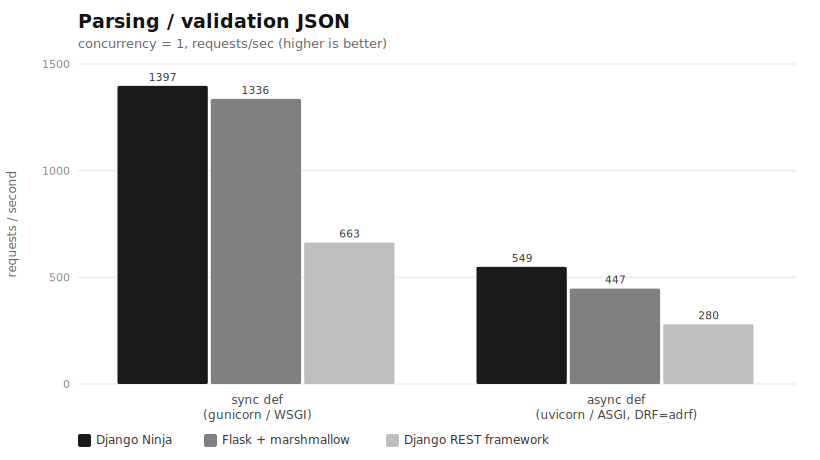
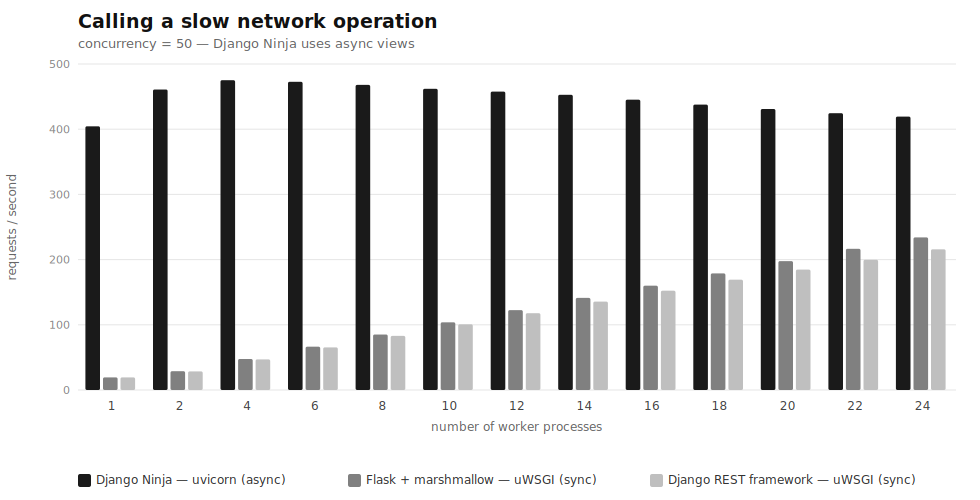

# django-ninja-benchmarks

## Results (2026)

<picture>
  <source media="(prefers-color-scheme: dark)" srcset="charts/2026-06-14-parse_validate-dark.svg">
  
</picture>

<picture>
  <source media="(prefers-color-scheme: dark)" srcset="charts/2026-06-14-concurrency-dark.svg">
  
</picture>

<sub>Re-run on a modern 2026 stack (this fork) — see [2026 local run](#2026-local-run-no-docker-no-root) below. Original 2020 result, for provenance: [charts/2020_results.png](charts/2020_results.png).</sub>

---

## 2026 local run (no Docker, no root)

The original suite was Docker + `ab` + uWSGI on a 2020 stack. The current version replaces it
with a self-contained way to run natively with [uv](https://docs.astral.sh/uv/), a modern
2026 stack, and [`oha`](https://github.com/hatoo/oha) instead of `ab` — no root needed
(uv's managed Python ships headers, so even uWSGI compiles).

```bash
uv venv --python-preference only-managed --python 3.14
uv pip install -r pyproject.toml   # single source of truth for the stack (uv.lock pins transitives)

# oha load generator -- pinned to the SAME version as the Dockerfile (OHA_VERSION) so
# local runs == CI. `cargo install oha` is intentionally avoided: it pulls *latest*,
# which silently drifts from the pin (oha's JSON flags changed across minor versions).
# The v1.14.0 release ships no checksums file, so the SHA256s below were computed from the
# assets (amd64 matches the binary the committed results were generated with). Pick your arch:
curl -L https://github.com/hatoo/oha/releases/download/v1.14.0/oha-linux-amd64 -o ~/.local/bin/oha
echo "6fc16b5f9901fd2266b1a2b49b1689f76f91ddc7c96f2d0d08b161a870f7ef18  $HOME/.local/bin/oha" | sha256sum -c -
chmod +x ~/.local/bin/oha
# arm64: oha-linux-arm64  ->  e0497f3304b18350f4e64de557372fd48e06768c970abaa7904c0a590670221a

uv run python cli.py bench local   # both panels -> benchmark_results/results_local.json
uv run python cli.py charts        # -> charts/<run-date>-{parse_validate,concurrency}{,-dark}.svg + index.html
```

`harness.py` pins the expected oha version (`OHA_VERSION`) and refuses to run if the
resolved binary's minor version differs, so a drifting `oha` fails loudly with a clear
message instead of a cryptic parse error. Keep `harness.OHA_VERSION` and the Dockerfile's
`OHA_VERSION` arg in lockstep; override the binary path with `BENCH_OHA=/path/to/oha`.

Lint/format are ruff (config in `pyproject.toml`, enforced by the `lint` CI workflow):

```bash
uvx ruff check .          # lint        (or: uv run --group dev ruff check .)
uvx ruff format .         # auto-format
```

### Runners / experiments

`cli.py` is the single front door — run `cli.py --help` to see every tool. It's a
thin pass-through to the standalone scripts (which still run on their own), so the
three HTTP experiments share `tools_bench.py`'s lifecycle/load plumbing in `harness.py`,
while `microbench` stays in-process with no server (one framework per process).
Every runner writes a `benchmark_results/results_*.json` that `cli.py charts` reads.

| command | what it measures |
|---|---|
| `cli.py bench local` | both original panels, native (sync apps on uWSGI, Ninja async on uvicorn) |
| `cli.py bench server-matrix` | parse/validate per framework x {uWSGI, uvicorn} — the server confound |
| `cli.py bench route-matrix` | parse/validate: sync `def`/gunicorn vs async `def`/uvicorn, incl. `adrf` |
| `cli.py microbench <fw>` | validation CPU only, no HTTP (pydantic vs DRF vs marshmallow), one framework per process |
| `cli.py charts` | renders each chart as light + dark SVG (colors overridable: `--ninja/--flask/--drf/--adrf`) |
| `cli.py check --dir DIR` | gate results_*.json against structural invariants (the CI regression gate) |
| `cli.py bench kill` | reaps stray servers left by an interrupted run — scoped to the bench ports/modules, won't touch other servers |

### How to read these numbers

- **Single worker per framework cell.** Every parse/validate and route cell runs the
  server with **one worker** (`--workers 1` / `-w 1`), i.e. one OS process handling
  requests serially. That's deliberate: it isolates *framework + validation* cost from
  the server's process-pool scaling, so the cells are comparable. It is **not** a
  "how many rps in production" number — real deployments run many workers. (The
  concurrency panel is the exception: it sweeps the worker count on purpose.)
- **Ratios, not absolutes.** The load generator (`oha`), the app server, and the
  network service all share the same ~8 cores on one machine — they are not pinned or
  isolated, so absolute rps is machine- and co-tenancy-dependent and will differ on
  your hardware. The *relative* ordering between frameworks is the durable result.
- **The network service is a fixed-latency stand-in.** `tools_network_service.py` is a Sanic
  app whose only work is `await asyncio.sleep(0.1)`. That models a slow upstream/I/O
  call, but it also imposes a ceiling of ~10 req/s per in-flight connection — so in the
  concurrency panel the saturation you see is the async/worker model meeting that
  upstream floor, not a pure client-side limit.

### Findings (2026-06-14, 8 cores machine)

- **Concurrency panel reproduces the 2020 original**: Ninja's async views saturate at 1
  worker (~385-478 rps, flat); sync Flask/DRF scale ~linearly with workers (19->~230 at 24).
  The sync curves are nearly identical — the whole gap is the async model, not the framework.
- **Validation CPU (isolated)**: pydantic-2 (Ninja) **27 us** << marshmallow **95 us** <<
  DRF serializers **588 us** — pydantic-2 is ~21x faster than DRF.
- **But at the HTTP layer that's mostly hidden**: at c=1, validation is <2% of request time;
  per-request stack/server overhead dominates. Held to one server, Ninja wins parse/validate.
- **Route-style factorial**: a sync `def` route is ~2.5x faster than an `async def` route on
  this CPU-bound endpoint (async overhead with no I/O to overlap), for every framework.
  Ninja leads in both stacks; `adrf` is the slowest cell.

Results are committed under `benchmark_results/` (`results_local.json`,
`results_server_matrix.json`, `results_route_matrix.json`) so the numbers live somewhere
reproducible, not just in a PNG.
