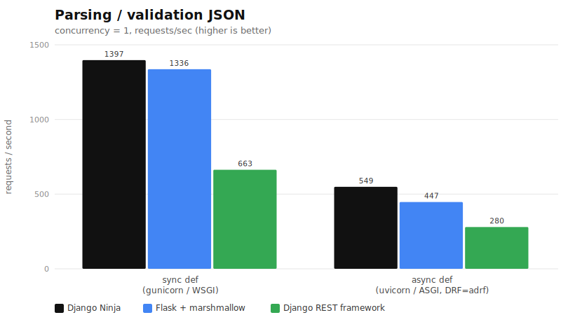
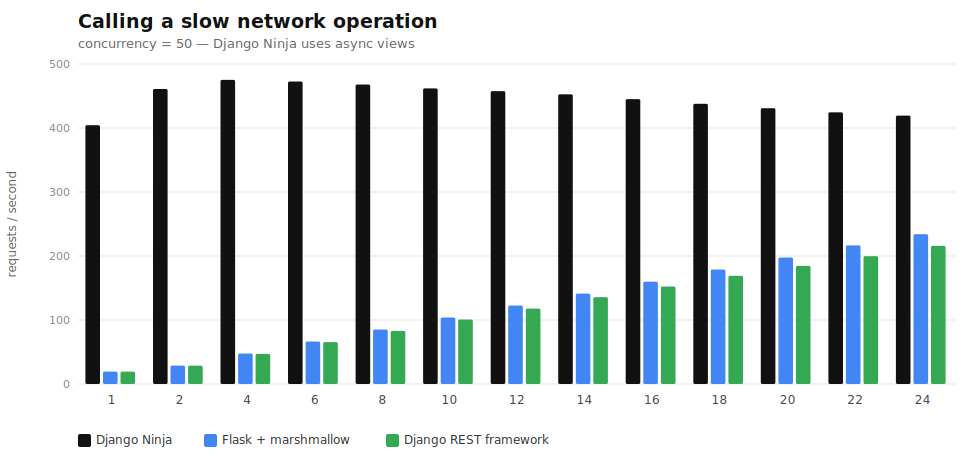

# django-ninja-benchmarks

## Results (2026)

<picture>
  <source media="(prefers-color-scheme: dark)" srcset="charts/parse_validate-dark.svg">
  
</picture>

<picture>
  <source media="(prefers-color-scheme: dark)" srcset="charts/concurrency-dark.svg">
  
</picture>

<sub>Re-run on a modern 2026 stack (this fork) — see [2026 local run](#2026-local-run-no-docker-no-root) below. Original 2020 result: [img/results.png](img/results.png).</sub>

---

### Original suite (2020, legacy)

The original Docker + ApacheBench + uWSGI suite. Kept for provenance; for new runs
prefer the native path in [2026 local run](#2026-local-run-no-docker-no-root) below.

Requirements: Python3, Docker + docker-compose, `ab`.

```
python run_test.py
```

---

## 2026 local run (no Docker, no root)

The original suite is Docker + `ab` + uWSGI on a 2020 stack. This branch adds a
self-contained way to run it natively with [uv](https://docs.astral.sh/uv/), a modern
2026 stack, and [`oha`](https://github.com/hatoo/oha) instead of `ab` — no root needed
(uv's managed Python ships headers, so even uWSGI compiles).

```bash
uv venv --python-preference only-managed --python 3.14
uv pip install -r requirements-local.txt
cargo install oha            # or grab a prebuilt binary from the oha releases

uv run python bench.py local # both panels -> benchmark_results/results_local.json
uv run python make_charts.py # -> charts/{parse_validate,concurrency}{,-dark}.svg (light + dark)
```

What changed vs the original apps: the network-service URL is read from
`NETWORK_SERVICE_URL` (so apps run outside Docker), `network_service.py` honors `PORT`,
and each app gained an `async def` `/api/create_async` variant (Flask via `asgi.py`,
DRF via `adrf`) for the route-style comparison below.

### Runners / experiments

The three HTTP experiments live behind one CLI, `bench.py` (shared lifecycle/load
plumbing in `harness.py`); `microbench_validate.py` stays separate because it runs
in-process with no server. Every runner writes a `benchmark_results/results_*.json`
that `make_charts.py` reads.

| command | what it measures |
|---|---|
| `bench.py local` | both original panels, native (sync apps on uWSGI, Ninja async on uvicorn) |
| `bench.py server-matrix` | parse/validate per framework x {uWSGI, uvicorn} — the server confound |
| `bench.py route-matrix` | parse/validate: sync `def`/gunicorn vs async `def`/uvicorn, incl. `adrf` |
| `microbench_validate.py <fw>` | validation CPU only, no HTTP (pydantic vs DRF vs marshmallow), one framework per process |
| `make_charts.py` | renders each chart as light + dark SVG (colors overridable: `--ninja/--flask/--drf/--adrf`) |

### How to read these numbers

- **Single worker per framework cell.** Every parse/validate and route cell runs the
  server with **one worker** (`--workers 1` / `-w 1`), i.e. one OS process handling
  requests serially. That's deliberate: it isolates *framework + validation* cost from
  the server's process-pool scaling, so the cells are comparable. It is **not** a
  "how many rps in production" number — real deployments run many workers. (The
  concurrency panel is the exception: it sweeps the worker count on purpose.)
- **Ratios, not absolutes.** The load generator (`oha`), the app server, and the
  network service all share the same ~8 cores on one machine — they are not pinned or
  isolated, so absolute rps is machine- and co-tenancy-dependent and will differ on
  your hardware. The *relative* ordering between frameworks is the durable result.
- **The network service is a fixed-latency stand-in.** `network_service.py` is a Sanic
  app whose only work is `await asyncio.sleep(0.1)`. That models a slow upstream/I/O
  call, but it also imposes a ceiling of ~10 req/s per in-flight connection — so in the
  concurrency panel the saturation you see is the async/worker model meeting that
  upstream floor, not a pure client-side limit.

### Findings (this machine, 2026-06-14, 8 cores)

- **Concurrency panel reproduces the original**: Ninja's async views saturate at 1
  worker (~385-478 rps, flat); sync Flask/DRF scale ~linearly with workers (19->~230 at 24).
  The sync curves are nearly identical — the whole gap is the async model, not the framework.
- **Validation CPU (isolated)**: pydantic-2 (Ninja) **27 us** << marshmallow **95 us** <<
  DRF serializers **588 us** — pydantic-2 is ~21x faster than DRF.
- **But at the HTTP layer that's mostly hidden**: at c=1, validation is <2% of request time;
  per-request stack/server overhead dominates. Held to one server, Ninja wins parse/validate.
- **Route-style factorial**: a sync `def` route is ~2.5x faster than an `async def` route on
  this CPU-bound endpoint (async overhead with no I/O to overlap), for every framework.
  Ninja leads in both stacks; `adrf` is the slowest cell.

Results are committed under `benchmark_results/` (`results_local.json`,
`results_server_matrix.json`, `results_route_matrix.json`) so the numbers live somewhere
reproducible, not just in a PNG.
